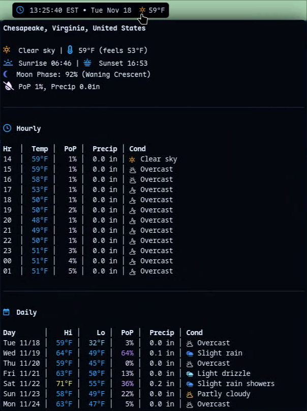
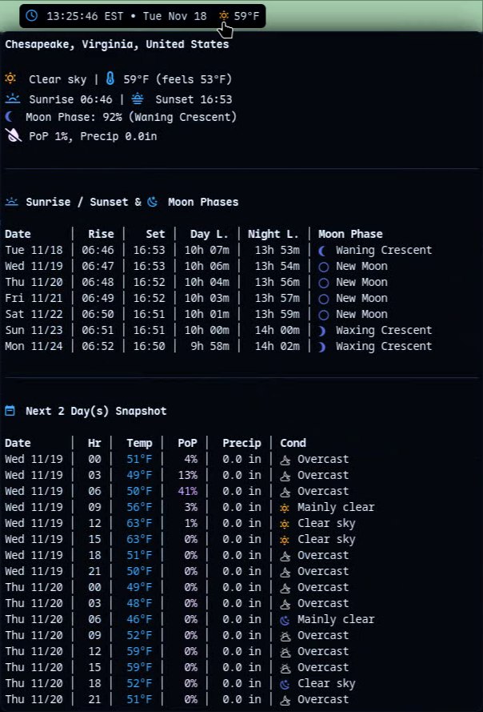
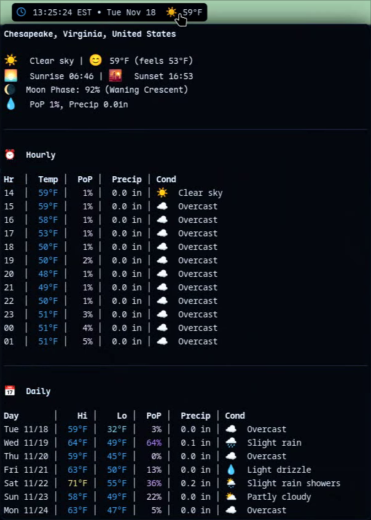
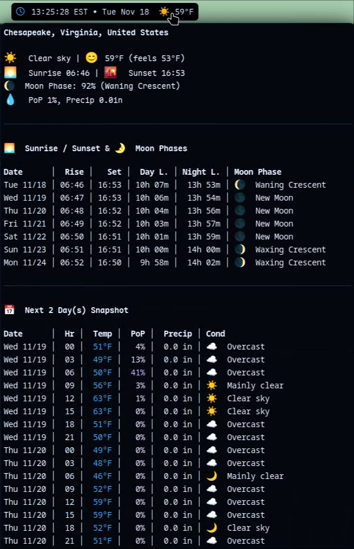

<p align="center">
  
</p>
<h1 align="center">Waybar Weather Widget</h1>

<p align="center">
  <a href="https://github.com/uhs-robert/waybar-weather-widget/stargazers"></a>
  <a href="https://github.com/uhs-robert/waybar-weather-widget/issues"></a>
  <a href="https://github.com/uhs-robert/waybar-weather-widget/contributors"></a>
  <a href="https://github.com/uhs-robert/waybar-weather-widget/network/members"></a>
</p>

<p align="center">
A <strong>detailed and customizable</strong> weather widget for Waybar, powered by the Open-Meteo API.

</p>

<https://github.com/user-attachments/assets/b50f95fa-8b9b-41f4-b33f-6bfda8e18fa2>

## ✨ Features

It provides current weather, hourly forecasts, and a multi-day forecast with a clean, icon-based display.

- **Current Weather:** Displays the current temperature and a weather icon for current conditions.
- **Geolocation:** Automatically detects your location via your IP address, or you can set a manual latitude/longitude.
- **Detailed Tooltips:**
  - **Default View:** Shows current details, an hourly forecast (default 12 hours, max 24), and a multi-day forecast (up to 16 days).
  - **Week View:** Shows a detailed 3-hour interval forecast for the next few days, including sunrise/sunset times with day/night length, the current moon phase, and a snapshot of the next few days (default 2, max 3).
- **Customizable:**
  - Supports both Celsius and Fahrenheit.
  - Supports both 12-hour (AM/PM) and 24-hour time formats.
  - Configurable hour display: as icons, numbers, or both.
  - Uses Nerd Font icons or emoji for weather conditions.
  - All colors are customizable.
  - Weather-specific icon coloring for Nerd Fonts.
  - You can change the number of hours and days to forecast, and the number of days in the week view snapshot.
- **Dynamic Icons:** Weather icons change for day and night.
- **Moon Phase:** Displays the current moon phase icon in the `weekview` tooltip.
- **Day/Night Length:** Shows the duration of day and night in the `weekview` tooltip.
- **Command-line Interface:** A simple CLI to toggle between tooltip views.

## 📸 Screenshots

Features a tooltip with multiple modes that can be cycled through to view more weather data.

In addition, you can use [nerd fonts](#nerd-font-view) or [emojis](#emoji-view) and customize all the colors!

<a id="nerd-font-view"></a>

<h3 align="center">🤓 Nerd Fonts</h3>

<table>
  <tr>
    <td align="center">
      <br>
      <strong>Default Tooltip</strong><br><em>Current Details, Hourly, Daily</em>
    </td>
    <td align="center">
      <br>
      <strong>Week Details</strong><br><em>Sunrise/Sunset, Day/Night Length, Moon Phase, 3-Hour Snapshot</em>
    </td>
  </tr>
</table>

<a id="emoji-view"></a>

<h3 align="center">😄 Emojis</h3>

<table>
  <tr>
    <td align="center">
      <br>
      <strong>Default Tooltip</strong><br><em>Current Details, Hourly, Daily</em>
    </td>
    <td align="center">
      <br>
      <strong>Week Details</strong><br><em>Sunrise/Sunset, Day/Night Length, Moon Phase, 3-Hour Snapshot</em>
    </td>
  </tr>
</table>

## ⬇️ Installation

1. **Clone the repository** or download the files into your `~/.config/waybar/` directory. Your structure should look something like this:

   ```
   ~/.config/waybar/
   ├── config.jsonc
   ├── style.css
   └── scripts/
       └── weather/
           ├── get_weather.rb
           ├── weather_icons.json
           └── weather_settings.jsonc
   ```

2. **Make the script executable:**

   ```bash
   chmod +x ~/.config/waybar/scripts/weather/get_weather.rb
   ```

## ⚙️ Configuration

1. **Add the module to your Waybar `config.jsonc`:**

   Add `"custom/weather"` to your `modules-left`, `modules-center`, or `modules-right` section. Then, add the following module configuration:

   ```jsonc
   "custom/weather": {
       "format": "{}",
       "tooltip": true,
       "return-type": "json",
       "exec": "~/.config/waybar/scripts/weather/get_weather.rb",
       "on-click": "~/.config/waybar/scripts/weather/get_weather.rb --next", // Cycle views
       "interval": 900 // Every 15 minutes
   },
   ```

2. **Configure the weather script:**

   Edit `~/.config/waybar/scripts/weather/weather_settings.jsonc` to customize the widget.

   ```jsonc
   {
     "latitude": "auto", // e.g., 40.71 or "auto" to detect from IP address
     "longitude": "auto", // e.g., -74.01 or "auto" to detect from IP address
     "unit": "Fahrenheit", // "Fahrenheit" or "Celsius"
     "time_format": "24h", // "24h" or "12h"
     "hour_display": "number", // "icons", "number", or "both"
     "hourly_number_of_hours": 12, // Number of hours to show in hourly tooltip (max 24)
     "daily_number_of_days": 10, // Number of days for forecast (max 16)
     "snapshot_number_of_days": 2, // Number of days for week view snapshot (max 3)
     "refresh_interval": 900, // Seconds between API calls (e.g., 900 = 15 min)
     "icon_type": "nerd", // "nerd" or "emoji"
     "icon_position": "left", // "left" or "right"
     "font_size": 14, // Base font size in px
     "colors": {
       "primary": "#42A5F5", // Default Nerd Font icon color
       "cold": "skyblue", // Temp cold
       "neutral": "#42A5F5", // Temp neutral
       "warm": "khaki", // Temp warm
       "hot": "indianred", // Temp hot
       "pop_low": "#EAD7FF", // Precipitation low
       "pop_med": "#CFA7FF", // Precipitation medium
       "pop_high": "#BC85FF", // Precipitation high
       "pop_vhigh": "#A855F7", // Precipitation very high
       "divider": "#2B3B57" // Divider color
     },
     "color_weather_icons": true, // Enable weather-specific icon colors for nerd fonts (false = use primary color)
     "weather_colors": {
       "clear_day": "#FFAC33", // ☀️
       "clear_night": "#FAC629", // 🌙
       "partly_cloudy_day": "#D89C4C", // ⛅
       "partly_cloudy_night": "#A88E3A", // ☁️
       "overcast": "#B0B0B0", // ☁️
       "fog": "#D3D3D3", // 🌫️
       "drizzle": "#87CEEB", // 💧
       "rain": "#4A90E2", // 🌧️
       "heavy_rain": "#1E90FF", // 💦
       "freezing_rain": "#00CED1", // 🌧️❄️
       "snow": "#87CEEB", // 🌨️
       "heavy_snow": "#B0E0E6", // ❄️
       "thunderstorm": "#9370DB" // ⛈️
     }
   }
   ```

## 💡 Usage

- **Hover** over the widget to see the detailed weather tooltip.
- **Click** on the widget to cycle between the `default` and `weekview` tooltips.

You can also manually set the view from your terminal:

```bash
# Cycle to the next view
~/.config/waybar/scripts/weather/get_weather.rb --next # --toggle is an alias

# Cycle to the previous view
~/.config/waybar/scripts/weather/get_weather.rb --prev

# Set a specific view
~/.config/waybar/scripts/weather/get_weather.rb --set default
~/.config/waybar/scripts/weather/get_weather.rb --set weekview
```

## 📦 Dependencies

- **Ruby:** The script is written in Ruby and uses standard libraries.
- **Nerd Font:** A Nerd Font is required to display the weather icons correctly. You can download one from [nerdfonts.com](https://www.nerdfonts.com/).

## 🙏 Credits

- **Weather Data:** [Open-Meteo](https://open-meteo.com/)
- **Geolocation:** [ip-api.com](https://ip-api.com/)
